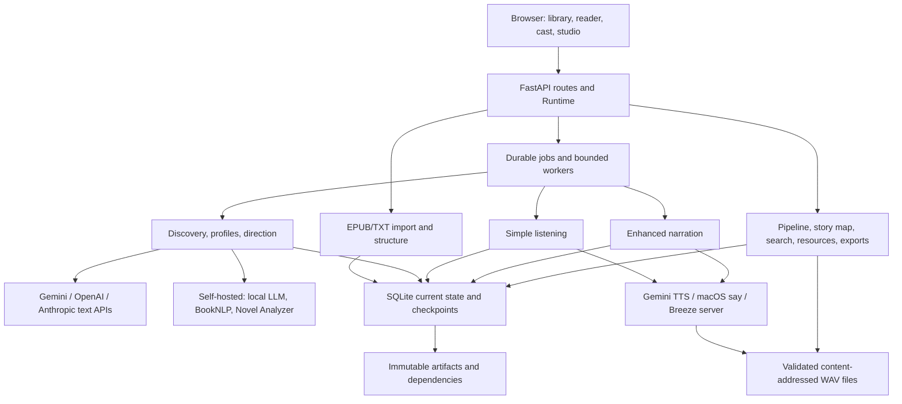

# Architecture

This document describes the implementation in this repository as of 2026-09-27. It is a guide to the code, not a specification of unimplemented features. See [the data model](DATA-MODEL.md) for persistence contracts and [the README](../README.md) for setup.

## Purpose and boundaries

Bardic is a local web application for importing an ebook, developing an evidence-backed performance script, generating narration, and reading along with passage highlighting. It also supports simple single-narrator listening without completing story analysis first.

The server is Python with FastAPI and SQLite. The browser uses HTML, CSS, and plain JavaScript; no frontend build system or JavaScript framework is required. Original ebooks and WAV assets are files on the local machine. Text analysis can call Gemini, OpenAI, or Anthropic and, in the step pipeline, the owner's self-hosted servers: an OpenAI-compatible LLM, BookNLP and a Novel Analyzer. Narration uses Gemini, installed macOS voices, or a self-hosted Breeze TTS server that the owner runs on the local network. Provider calls are explicit processing actions; browsing saved work does not generate narration or run cloud story analysis.

The application has a single local owner. It is not a multiuser service, hosted library, DRM-removal tool, or general workflow scheduler. The default server binds to loopback. An opt-in local-network mode (`BARDIC_LAN_NAME`) binds the network and advertises a `.local` name for the same single owner's other devices; it adds no authentication and treats everyone on that network as the owner. Public or multiuser deployment would require authentication, authorization, and operational design.

## System map

SQLite is the authoritative application store; JSON book projections make reader and editor requests straightforward. Relational tables hold membership, links, observations, jobs, caches, and artifact dependencies where these need independent lifetimes or queries. SQLite FTS5 supplies rebuildable lexical search. There is no vector database or separate graph database.

## Module responsibilities

| Module | Responsibility and important boundary |
| --- | --- |
| [`__main__.py`](../bardic/__main__.py), [`config.py`](../bardic/config.py), [`lan.py`](../bardic/lan.py) | Load the project `.env`, choose the bind address and port, start Uvicorn. Optionally trust and advertise a `.local` name while the server runs. |
| [`service.py`](../bardic/service.py), [`bardicctl`](../bardicctl) | Operations tooling, not imported by the app: run the owner's server as a macOS LaunchAgent and start/list/stop isolated development servers. |
| [`app.py`](../bardic/app.py) | Request validation, routes, local HTTP protections, `Runtime`, worker submission, cancellation, presentation, editing, playback, and export endpoints. |
| [`apispec/`](../bardic/apispec/) | The published HTTP contract: one module per route family with operation descriptions, response views, errors and cost. It builds `/openapi.json` and `contract/`, and validates responses in tests. Views are not applied at runtime. |
| [`store.py`](../bardic/store.py) | SQLite connections and lock, current book/take/job/settings state, atomic analysis publication, startup interruption recovery, process lock. |
| [`importer.py`](../bardic/importer.py) | Safe EPUB/TXT ingestion, canonical text extraction, initial scenes/passages, bounded cover thumbnails. |
| [`structure.py`](../bardic/structure.py) | EPUB navigation/NCX/headings/section classification, metadata-only structure repair and checkpoint transformation. |
| [`preprocessing.py`](../bardic/preprocessing.py) | Local census, frequency/spread/ambiguity heuristics, processing priorities, eligible sections. No LLM calls. |
| [`analysis.py`](../bardic/analysis.py) | Provider adapters (including the self-hosted Local LLM, used only by the step pipeline), schemas, evidence validation, local draft rules, annotation application, dispatch to the appropriate pipeline. |
| [`local_services.py`](../bardic/local_services.py) | Self-hosted analysis servers: URL validation, the BookNLP and Novel Analyzer HTTP calls with bounded retries, and pure mapping of their output onto passages, cast IDs and exact source excerpts. |
| [`staged_analysis.py`](../bardic/staged_analysis.py) | **Legacy, being removed** ([Classic removal](CLASSIC-REMOVAL.md)). Older chapter-checkpoint runner, its local draft path and the checkpoint's reference builder. |
| [`progressive.py`](../bardic/progressive.py) | **Legacy, being removed.** The phase runner behind `/analyze`, `/analysis-plan` and `/preprocessing`: scan/profile/direct/full planning and execution, its request recipes, unit reuse and progressive publication. |
| [`legacy_phase.py`](../bardic/legacy_phase.py) | **Legacy, being removed.** The phase runners' `analysis_units` cache (`LegacyProcessingStore`) and their discovery coverage reader. Only the legacy modules, their routes and the `/pipeline` readout import it; [a test](../tests/test_legacy_isolation.py) enforces this. |
| [`processing.py`](../bardic/processing.py) | Shared request infrastructure: attempt/event ledger, local census cache, per-request reservations and budget enforcement, content digests, token estimates and prices. Does not create or read `analysis_units`. |
| [`analysis_common.py`](../bardic/analysis_common.py) | Scene-boundary publication for directing results, and the saved checkpoint fingerprint that structure repair re-keys. |
| [`model_catalog.py`](../bardic/model_catalog.py) | Documented model choices, dated pricing metadata, explicit account inventory refresh, custom model support. Listing a model does not prove generation compatibility. |
| [`account_checks.py`](../bardic/account_checks.py) | Explicit small text requests that test an account/model and classify errors. Does not retrieve a credit balance. |
| [`series.py`](../bardic/series.py) | Explicit series membership, confirmed character identities, bounded accepted evidence from earlier supplied volumes (series memory), identity-link suggestions, legacy retained observations. |
| [`series_processing.py`](../bardic/series_processing.py) | Series runs on the step pipeline: per-book pipeline plans and one series fingerprint, a parent job with one `pipeline` child per book in reading order, per-book consent re-check before start (context-pending profiles), review pause and resume, cancellation and failure settlement. |
| [`library.py`](../bardic/library.py) | Editable metadata, covers, measured storage, reversible removal/restoration, explicit missing/planned volume slots. |
| [`artifacts.py`](../bardic/artifacts.py) | Immutable content-addressed versions, mutable current heads, verified dependency edges, projection capture and honest legacy backfill. |
| [`pipeline/`](../bardic/pipeline/) | Step-based analysis: step contract and registry, built-in steps and their request builders (`prompts.py`), runner (planning, bounded parallel units, metered requests, unit cache), candidate versions, accept/reject/rollback with a revision-guarded projection, outside-change capture, HTTP router. Runs never write the book projection. See [the analysis pipeline](ANALYSIS-PIPELINE.md). |
| [`pipeline_view.py`](../bardic/pipeline_view.py) | Source-anchored story map, portable analysis export, and the `/pipeline` progress readout. The readout reads the legacy phase state; see [Classic removal](CLASSIC-REMOVAL.md). These views expose implemented state rather than run a second pipeline. |
| [`search.py`](../bardic/search.py) | Local literal-word search with source coordinates, limited to the selected book or it plus earlier active series volumes. |
| [`audio.py`](../bardic/audio.py) | Narration provider table (`PROVIDERS`), per-provider voice accessor, recipe and generation dispatch, Gemini/macOS adapters, audio validation/normalization, and sample-accurate WAV assembly. |
| [`breeze.py`](../bardic/breeze.py) | Self-hosted Breeze TTS adapter: server URL validation, explicit voice check with revision pinning, pure recipe fields, streaming generation behind a live pre-send voice check, sentence-timing validation, and voice management (design previews, clone upload, rename, delete, reference clips). Checking voices never generates audio. |
| [`gemini_voices.py`](../bardic/gemini_voices.py) | Gemini Voices API client: list the project's stored voices, create a prompted (designed) voice, read its sample, delete it. A create is billed, stored in the Google project, and never resent after an uncertain outcome. |
| [`voice_library.py`](../bardic/voice_library.py) | Library-wide named voices with immutable versions and a mutable current-version pointer, an append-only event log, mutable design drafts, content-addressed audition audio, per-voice usage, and local resolution of cast assignments. Never contacts a provider. |
| [`voice_routes.py`](../bardic/voice_routes.py) | `/api/voices*` routes: library view, drafts and candidate generation, save/assign, clone, rename, version switch, delete, Breeze default, auditions, Gemini voice refresh, and Breeze server-voice import. Provider calls run outside the store lock. |
| [`take_archive.py`](../bardic/take_archive.py) | Private rendering followed by validated, atomic, content-addressed audio publication. Distinguishes generation recipe from actual resulting bytes. |
| [`voice_previews.py`](../bardic/voice_previews.py) | Bounded contextual/demo auditions, retained input recipes and independent byte-addressed preview takes. Never edits casting or selected simple/enhanced takes. |
| [`listening.py`](../bardic/listening.py) | Independent single-voice sessions/takes and a content-equivalent synthesis cache; intentionally excludes enhanced casting and performance directions. |
| [`resources.py`](../bardic/resources.py) | Durable local/narration measurements and combined resource summaries, preserving unknown measurements and avoiding double-counting analysis attempts. |
| [`diagnostics.py`](../bardic/diagnostics.py) | Bounded local operational event log; validates safe fields, suppresses duplicates, limits client events and prunes old rows independently of immutable provenance. |

## Browser and API flow

[`static/index.html`](../bardic/static/index.html) defines the page and dialogs. [`static/app.js`](../bardic/static/app.js) coordinates selected book/chapter/passage, settings, cast and script editing, job polling, and audio playback. Feature scripts expose `window.Bardic…` interfaces:

| Feature | Browser files | Main API families |
| --- | --- | --- |
| Library and removed items | `library.js`, `library.css` | `/api/library`, book metadata/cover/archive/restore, series and volume slots |
| Cast assignment (**Cast** tab) | `app.js` with helpers from `voices.js` (`BardicVoices.cast`) | Character PATCH `voices`, `/api/voices` |
| Voice library (**Voices**, an app-level page in the sidebar) | `voices.js`, `voices.css` (`window.BardicVoices`) | `/api/voices`, `/api/voices/drafts…`, `/api/voices/breeze/clone`, `/api/voices/gemini/refresh`, `/api/narration/breeze/refresh` |
| Voice examples | `voice-preview.js`, main player in `app.js` | Book `/voice-preview`, `/voice-preview/audio/{asset_id}` |
| Single-narrator listening | `listen.js`, `listen.css` | Book `/listen`, `/listen/takes`, `/listen/audio/{asset_id}` |
| Progressive production (older phase runner) | `production.js`, `production.css`: no longer loaded by the page; the backend stays until series runs move to the step pipeline | Book `/preprocessing`, `/analysis-plan`, `/analyze`, `/analysis` |
| Series identity review | `series.js`, `series.css` | Book `/series`, character links, link suggestions, series characters/context |
| Collection processing | `series-processing.js`, `series-processing.css` | Series `/plan`, `/process`, `/runs`, `/runs/{job}/resume`, `/map` |
| Analysis pipeline (**Analyze** tab) | `analysis-pipeline.js`, `analysis-pipeline.css` | `/api/analysis-pipeline`, book `/analysis-pipeline` (plan, runs, versions, preview, accept, reject) |
| Pipeline inspection (**Details** tab) | `pipeline.js`, `pipeline.css` | Book `/pipeline`, `/artifacts`, `/story-map`, `/search`, `/analysis-export` |
| Resource usage (**Details** tab) | `resources.js`, `resources.css` | Book `/resources` |
| Book lifecycle strip, routes, breadcrumb | `lifecycle.js` (`window.BardicLifecycle`, pure), `shell.js` (`window.BardicShell`) | Book `/analysis-pipeline` overview (read-only) |

The table summarizes endpoint families. The complete, versioned contract is checked in as [`contract/openapi.json`](../contract/openapi.json), with a readable [reference](../contract/API-REFERENCE.md). It is generated from the route DTOs and the descriptions in [`bardic/apispec/`](../bardic/apispec/), which the test suite checks against every response. The contract is normative for future clients and for any replacement server; see [the API workflow](API-WORKFLOW.md). The running server also serves the contract at `/openapi.json`; Swagger `/docs` and ReDoc are disabled.

### Browser UI

The page has app-level places in the sidebar (**Library**, **Voices**, **Books & series**, **Providers & settings**) and five book tabs in lifecycle order: **Read & listen · Analyze · Cast · Script & record · Details**. Element IDs and `data-tab` values are stable (`read`, `analysis`, `cast`, `studio`, `details`); labels may change. **Voices** (`#voices-view`) is outside the book workspace, so it opens without a book; `setTab('voices')` shows it and a book reopens on its last tab (`state.bookTab`).

- **Lifecycle strip.** `lifecycle.js` computes four stages from one source each: Analyze (accepted results for Character discovery, Character profiles and Speakers & delivery in the analysis-pipeline overview; directing staleness does not count against "done"), Cast (speaking characters with a voice for the service chosen under Record the book), Script (passages with a speaker other than Unassigned) and Record (current Studio takes, the only audio Export packages). It returns one state per stage and one Next; nothing is suggested while the overview loads. `shell.js` fetches the overview when the book, its revision or an analysis job's status changes, and after leaving Analyze. The strip expands in place into stage cards. It replaced the old `#book-status` line and the Studio "01/02/03" guide.
- **Routes.** `#/library`, `#/voices` and `#/book/<id>/<tab>` (plus `#/book/<id>/analysis/<step>`, which opens that Analyze step) go through `setTab` and `selectBook`; navigation pushes a history entry, back and forward reapply the route, and a route on load wins over the last opened book. The breadcrumb follows the route.
- **Narrator surface.** **Choose your narrator** (the listen sheet) is the one place to choose a narrator. The single-narrator panel that `listen.js` renders (`#simple-listen` inside `#listening-drawer`) now sits in the sheet under **More options**; Read & listen shows its summary as one line with **Change**.
- **Details** holds resource use and the pipeline explorer (provenance and inspection, which reads the older phase checkpoints), with source search and the analysis export inside the explorer. The older phase runner ("Classic") is no longer shown or wired; its backend and `production.js` remain until series runs move to the step pipeline.
- **Script.** `script.js` renders the Script & record script one chapter at a time (the chapter menu, Previous and Next share `setChapter` with the reader). **Needs a look** chips (Unassigned speaker, Low confidence ≤ 65%, BookNLP disagrees when the book carries BookNLP checks, Your edits, Not recorded) filter the chapter's passages, with chapter and whole-book counts and the count per chapter in the chapter menu. Edits save on change through the existing passage and scene `PATCH` routes, one field per request and one request at a time, so only the field you changed gets an edit lock; text saves after a pause or on leaving the field, failures stay on the row with **Try again**, and unsaved text survives re-renders, chapter changes and (with a prompt) leaving the page. Bulk speaker assignment sends one passage edit per selected passage in order and reports partial failure. Analyze's **Show in text** (`bardic:show-passage`) opens the passage here with its speaker menu focused.

An import posts an EPUB/TXT, saves its original bytes, creates canonical chapters and anchored passages, and makes the book readable immediately. Cast and scene data start as a local draft. The reader highlights a whole passage while that passage's audio plays. Position and playback speed are browser-local preferences; the browser does not save API keys in local storage.

Simple listening warms a short buffer before playback, then prepares ahead according to real saved durations and playback speed. The browser serializes single-passage requests: warmup targets 10 listening seconds with a three-passage cap; rolling preparation targets 45 listening seconds with at most 12 future passages in the chapter. It locally preloads the next two available clips. An explicit Prepare rest of chapter action fills the remaining chapter without autoplay. Browser intent/selection guards prevent late responses from continuing playback or scheduling new work after Stop or a selection/configuration change; completed single-passage jobs remain reusable after reload.

The listen API checks cache first and joins an existing non-cancelled job for an identical session/passage before considering new work. The client retries only bounded read-only polling, not potentially charged generation POSTs. Errors halt preparation without deleting ready audio. Enhanced production separately analyzes the story, lets the user review/edit cast and directions, and renders selected passages, scenes, or the book. The reader can use either mode; simple takes do not overwrite enhanced selections.

Voice examples use the same audio element, transport and speed as book playback. `static/voice-preview.js` owns explicit audition request intent, serializes requests, waits for stopped simple-listening work to settle, polls known jobs and rejects stale completions. `app.js` pauses reading/lookahead, preserves the passage/offset bookmark, displays sample text and restores the paused book when the example closes. Voice dropdown changes and passive renders cannot generate samples. Cast and passage controls snapshot unsaved choices without saving editor forms; the server resolves/validates source, bounds the prefix to 400 Python Unicode code points and snapshots its effective delivery recipe before queueing one job. A generic original demo is used only when there is no selected or attributed passage. Preview metadata and WAVs have their own archive and cache; they do not select production takes or join the simple-listening cache.

The simple panel delegates Play/Pause and speed changes to the main player. Its displayed state is an input from the shared player; changing speed updates an existing warmup target without promoting it to rolling playback. The footer shows the current narrator and links back to the listening settings.

`static/diagnostics.js` sends best-effort, allowlisted browser event codes and operational IDs through `/api/diagnostics`; it sends no free-form messages, source text, stack traces, URLs or credentials. The server adds listen-job failure/stop/submission correlation using the same bounded store. Settings links to a JSON download. This logging path cannot control playback success or trigger model work. Its newest 5,000 events are intentionally a rotating troubleshooting window, not immutable analysis provenance.

## Source and structure

EPUB import follows the package spine for reading order and uses EPUB navigation, NCX, headings, and semantic markers for names and section kinds. It does not invent chapter numbering from spine position. Front matter, recap, narrative chapters, and back matter remain distinguishable. Multiple anchor targets inside one spine document are represented by `logical_sections` metadata; the retained chapter container remains the processing/source unit. Full logical-section repartitioning is not implemented.

The importer rejects unsafe ZIP members, unsupported encrypted reading content, oversized archives, and malformed XML. Optional cover failures do not discard readable prose. Cover images are decoded and re-encoded as small JPEG thumbnails; embedded remote image URLs are not fetched.

Canonical chapter text is the extracted, normalized reading text, not byte-identical EPUB markup. Scene ornaments become same-width spaces during import. Once imported, analysis annotates that canonical text rather than rewriting it. Passage and evidence coordinates must continue to resolve to exact slices. Structure repair reparses the saved original and requires matching chapter count and exact canonical chapter texts before updating names/kinds/navigation metadata. It preserves IDs, source offsets, profiles, selected audio, and reusable accepted work. See [structure details](STRUCTURE.md).

## Progressive cloud analysis

The normal HTTP analysis request defaults to `phase="scan"`. `analysis.analyze_book()` dispatches cloud requests with an explicit phase and store to `progressive.run()`. Local draft work and compatibility calls without a phase still use the older staged implementation. Calls without a store use the original in-memory implementation; they do not acquire the progressive repository's durable budget/cache behavior.

The progressive phases are:

1. **Local census.** Scan source and current annotations without a model. Count appearances, spread, explicit speech tags, unresolved attribution, and ambiguity. These heuristics guide effort; they do not establish identity or scene presence.
2. **Scan / discovery.** Process eligible sections in bounded source ranges, normally up to 24,000 characters per range. Validate every quoted piece of evidence. Save each accepted result durably, recover its cast candidates, and expose completed source coverage.
3. **Profiles.** Build character requests from grounded observations with bounded evidence selection and effort tiers. Add bounded evidence from explicitly linked characters in earlier active series books. A profile remains provisional while relevant whole-book discovery is incomplete; complete coverage still does not guarantee correct interpretation.
4. **Direct.** Analyze bounded passage batches with neighboring source and relevant cast context. Apply speaker attribution, scene/performance annotations, and supported cues without changing the source text. Reviewed edits take precedence over generated replacements.
5. **Full.** Execute the above cloud phases in order, reusing accepted work where eligible. The initial plan cannot know all work introduced by newly discovered characters or retries.

Front/back matter are excluded from default semantic coverage; a specifically selected section can still be processed. The pipeline's `scan` model is independently configurable from the deeper analysis model. The word “preprocessing” in model settings refers to this cheap cloud discovery role; the local census remains a separate free step.

Evidence validation accepts only a short contiguous source quotation, with constrained typography/whitespace normalization mapped back to exact source coordinates. A quotation mark added at an excerpt edge (a common model habit when an excerpt starts or ends mid-dialogue) is dropped if the remaining text of two or more words matches exactly. It does not accept paraphrases, invented spelling, or separated snippets joined with ellipses. One repair generation is allowed after a response rejected for unanchored evidence or for skipped, repeated or unknown passage IDs. Invalid results never become accepted annotations.

### Step pipeline

The Analysis tab drives the same analysis work as named steps: chapters & titles, census, discovery, quote attribution (BookNLP), profiles, and speakers & delivery. Each step has its own provider and model and produces candidate versions per scope. The reader sees a result only after it is accepted, either automatically by the step's gate or by the owner. Accepting an older version rolls back. Manual edits are per-field locks. Changes made by the phase controls are recorded as `external` versions before the next pipeline decision. Details and the extension contract: [analysis pipeline](ANALYSIS-PIPELINE.md).

## Reuse, invalidation, and failure

There are three separate persistence mechanisms:

- The **current book projection** drives the reader and editors.
- **Checkpoints and accepted-unit caches** resume processing and avoid repeating accepted requests.
- **Immutable artifact versions** retain current and historical outputs, exact known input recipes, and verified dependency links.

An analysis unit key hashes the effective request and validation recipe: provider/model, prompt, system instruction, response schema, output cap, adapter/pipeline/validator versions, and chapter/range or character locator. Including the locator prevents identical prose in different chapters from sharing the wrong annotations. Dependency artifact IDs provide lineage; they are not substituted for the effective request input when determining equivalence. Validated discovery for the same current source interval may be reused across provider changes while retaining its actual original producer.

Accepted units are saved before chapter publication or progress callbacks. If publication fails, resuming can recover the accepted result instead of paying for it again. Cached data is revalidated; a rejected cache entry is removed from the fast cache, while immutable history remains. Changed profile/cast inputs make dependent directing recipes stale. Changing voice or performance instructions changes the audio recipe; earlier WAV assets remain retained. This is specific, recipe-based freshness logic, not a general graph engine that automatically propagates every kind of invalidation.

`Store.commit_analysis()` commits book projection, checkpoint, current references, retained observations, and associated artifacts in one SQLite transaction. Durable state is published between bounded units. Cancellation is cooperative between calls/units; an in-flight provider request may finish and incur cost. Restart marks active jobs/checkpoints interrupted. A new explicit run resumes reusable work; the server does not automatically resume remote generation on startup.

## Cost controls and measurements

Each progressive HTTP attempt reserves a request count, input allowance, output allowance, and conservative estimated cost **before** it is sent. Per-run request/token limits differ from the dollar allowance, which applies cumulatively to tracked analysis attempts for the book, including earlier runs. Defaults are defined by `AnalysisLimits` in [app.py](../bardic/app.py). Analysis tab pipeline runs are the exception: they reserve and record every attempt but have no cap unless an API caller sets one; the confirmed plan preview authorizes the run ([details](ANALYSIS-PIPELINE.md#cost-caching-and-provenance)).

In the metered path, a transient HTTP error permits at most two total HTTP attempts per provider-adapter invocation, subject to the remaining allowance. Authentication/billing failures are not retried. A failed connection (`ConnectError`/`ConnectTimeout`) sent nothing, so it is recorded as `not_sent` at zero cost and uses the same bounded retry. An uncertain network outcome is recorded and not automatically repeated. A single repair generation may invoke the adapter a second time, so one logical analysis unit can have up to four HTTP attempts when both invocations need their permitted transport retry. Every attempt consumes the same guards.

Unknown pricing blocks use of a dollar guard; an explicit request/token-only configuration can proceed without that guard. Missing provider usage keeps a conservative reservation. Displayed planning estimates are smaller forecasting estimates, not reservations, invoices, or guaranteed final totals. Account checks only test a small text request; they do not expose an actual credit balance.

Resource views combine the analysis attempt ledger, local/narration operations, and cache events. Unknown historical usage stays unknown. Local CPU measurement covers the current Python thread, excluding subprocesses, other threads, GPUs, and remote compute. Summed operation time is not whole-job wall-clock latency when work overlaps. Narration has resource telemetry but does not currently share the progressive analysis request/token/dollar guard. See [resource and listening details](LIBRARY-LISTENING-RESOURCES.md).

## Series processing and identity

Books remain independent sources with independent chapter IDs, profiles, coverage, takes, and budgets. Adding a volume does not concatenate novels into one giant prompt or flatten their evidence.

A book can belong to one series at an explicit numeric reading position. Decimal positions support side stories. Series characters are separate identities; a matching name is not enough to link two book characters. User-confirmed links select which earlier-volume observations can influence a later book. Context excludes later books, archived sources, stale source hashes, and mere mention records. Its bounded selection does not imply complete knowledge of every earlier observation.

Missing/planned volume slots are explicit library metadata with no source text. A collection run skips them and processes only supplied active books; gaps remain visible and no knowledge of an absent volume is inferred. Discovery does not automatically confirm newly discovered cross-book identities. Reviewing links between discovery and profiles is useful when building series continuity.

A series run applies one set of pipeline steps to each supplied book, one book at a time in reading order ([design](ANALYSIS-PIPELINE.md#series-runs)). A parent job reserves all child books until the run ends, preventing edits, membership changes, version decisions or restoration of an archived member from changing its scope mid-run. Confirming the series fingerprint authorizes the run; a changed plan is refused with 409 before queuing, and each book is re-planned and compared with its confirmed fingerprint before it starts. Optional limits apply per book. A failure stops scheduling new books; already running bounded work settles cooperatively. Accepted pipeline results in one book are not yet read by later books.

## Audio production

An enhanced narration recipe combines the exact passage, provider/model, selected voice, character and scene/performance instructions, and audio format version. `audio.PROVIDERS` holds one row per narration provider (label, default model/voice, credential kind and the capability flags callers read, such as `chunked_listening`, `seeded_takes` and `cost`). `_recipe` builds the shared fields and delegates provider fields through `_RECIPES`; `_generate` dispatches the network call. A character stores one voice choice per provider in `voices`; `voice_selection()` reads that map and falls back to the earlier `voice`/`system_voice` fields, so Gemini and device recipes are byte-identical to those produced before the provider table existed (pinned by golden fingerprint tests). Device narration uses `say` and `ffmpeg`; it does not provide Gemini-style expressive steering.

Breeze voices are mutable server records, so a Breeze voice is pinned locally as `{id, revision, seed}`: in a library voice version, in a listening session, or (for choices made before the voice library) directly on a character. The revision hashes only speech-affecting server state, including the SHA-256 of the reference clip. Fingerprints read the pinned copy and never the network, so Breeze takes stay valid after a restart or while the server is offline. Immediately before each request the worker fetches the live voice and its reference clip; a changed revision stops the take before any speech request is sent. Generation uses the server's SSE stream (`pcm_24000`) because a client disconnect there stops the server's GPU work; the collected PCM is wrapped as WAV and validated and published like any other take, never played while streaming. Performance notes become a Breeze `instruction` (at most 1,000 characters, rejected rather than truncated). Busy/loading 503 responses are retried a bounded number of times after `Retry-After`. Breeze has no per-request charge; resource operations record the request with cost basis `self_hosted`.

### Voice library and cast assignment

The workspace separates the **Cast** tab (who speaks with which voice) from the **Voices** tab (making, auditioning, iterating and managing voices). Voices belong to the whole library, not a book. A library voice (`vl_…`) is a Breeze or Gemini voice with a name, description and immutable numbered versions; each version is one fixed provider voice (a Breeze server voice pinned to its revision, or a Gemini `voice_…` id). The voice's current-version pointer and name/description are its only mutable fields, and every pointer change, default change, creation and deletion is recorded in an append-only event log.

A character's choice for a provider is a library reference (`{"library": …}`, following that voice's **current** version), a direct provider voice (a Gemini built-in or project voice, a device voice, or an earlier concrete Breeze pin), or nothing, meaning **Default**. Breeze's Default is the Bardic default library voice (`narration_defaults.breeze`); the listen panel's and voice examples' Breeze Default mean the same voice. Gemini's Default remains Kore and the device default remains the system voice. The Narrator and Unassigned dialogue characters are listed first in the Cast.

`Runtime.resolved_cast()` turns assignments into concrete provider voices from SQLite alone, so takes validate offline. It runs once per call site (presentation, edit invalidation, export, pipeline view, analysis publication) and once when an enhanced render job is created, so a version or default change during that job cannot mix voices within it. An unresolvable assignment (deleted voice, no default, wrong provider) becomes an error marker, and `voice_selection()` refuses it: nothing falls back to Kore or a device default. Enhanced takes and Breeze voice examples made with a library voice record `voice_library` `{id, version}`; every Breeze take records `voice_revision`.

Saving a new version, switching the current version back, or changing the Breeze default re-voices every character that follows it: their selected takes become out of date (retained in history). These changes are refused while a render, listen, chapter or example job is active for an affected book. Switching back and rendering again reuses the archived WAV whose fingerprint matches, without a provider request.

Voice design runs through drafts. Breeze drafts generate one to three free previews (a synchronous request of roughly the audio length × count on the owner's GPU); Bardic keeps a validated copy of each. Saving uploads the auditioned clip as a cloned voice with a generated id (`bardic-<8 hex>`, labels `bardic_voice`/`bardic_version`), so saving survives the server's 24-hour preview expiry; the server re-encodes its stored reference, so the pinned revision hashes what the server keeps. Each Breeze version is a separate server voice, so older versions stay re-renderable. A Breeze voice check imports every usable server voice as a library voice (origin `imported`) and chooses an initial default; voices removed from Bardic are not re-imported. Gemini drafts create one billed, stored project voice per confirmed click; unchosen candidates are deleted from the project on save or abandon, and every Gemini version records a hash of the project key so another key cannot use or delete it. Deleting a voice Bardic made deletes its provider voices; deleting an imported voice removes it from Bardic only unless the server deletion is requested. The Breeze default cannot be deleted.

`take_archive.produce_take()` renders into a private temporary file, checks the returned recipe fingerprint, validates the WAV, hashes its final bytes, and publishes without replacing an existing asset. The recipe fingerprint identifies the requested performance; the asset hash identifies a particular result. Two generations of one recipe can therefore coexist. WAV assembly uses real sample counts, and export joins only complete chapters.

Simple listening retains a narrator session and exact passage identity. It excludes inferred speaker, character traits, scene directions, and cues. Cast edits therefore do not invalidate simple listening audio. A separate rebuildable index hashes equivalent speech inputs without passage IDs so exact text and voice/provider/model recipes can reuse audio across passages/books. WAV validity and content hashes are checked before reuse; a new target take records its own source binding and a pointer to the actual retained input, keeping the original producer fingerprint. Target books receive independent audio-file copies. Its sessions, takes, and audio directory remain separate from enhanced production.

Current highlighting/timelines are passage-level. Breeze takes also retain sentence timing (`provider_timing`) when every returned offset resolves to the exact sent text; nothing uses it for highlighting yet. Word alignment, verification that every word was actually spoken, continuous scene-level acting synthesis, and automated audio quality scoring are not implemented. The [word-highlighting proposal](WORD-HIGHLIGHTING.md) recommends optional per-asset alignment with passage fallback. Buffering cannot guarantee that an unmeasured provider will sustain 2.5× consumption; chapter preparation is available when generation lags.

## Concurrency, migration, and operational boundaries

The normal server owns one data root, protected by `InstanceLock`. SQLite uses WAL, a 30-second connection timeout, foreign-key enforcement, and an application `RLock`. Ordinary book jobs use one worker. A separate series coordinator owns its bounded discovery pool, so the application as a whole is no longer strictly single-worker. Editing guards protect reserved books and active series scope.

Schema setup is additive `CREATE TABLE/INDEX/TRIGGER IF NOT EXISTS`, with targeted legacy data conversion and idempotent artifact backfill. There is no numbered migration framework, schema downgrade mechanism, or general restore wizard. Backfill preserves data that still exists and labels incomplete provenance; it cannot recreate overwritten pre-history. Constructing a `Store` also performs restart recovery, so maintenance scripts must not casually instantiate a second live store.

Settings loaded from `.env` remain environment configuration; keys entered through the UI live in runtime memory. Saved preferences omit keys. Provider requests carry credentials directly to the selected provider, never into analysis artifact payloads or exports. Source text and exact prompts do belong in local artifacts and analysis exports. See [data ownership and backup](DATA-MODEL.md#files-exports-and-backups).

## Implementation limits and extension points

| Area | Current boundary |
| --- | --- |
| Import | EPUB/TXT only; retained EPUB containers can have multiple logical sections; no PDF/MOBI/DRM workflow. |
| Semantic analysis | Structured cloud or self-hosted annotations plus local rules. The self-hosted providers exist only in the step pipeline (including series runs), not the phase controls. No automatic identity reconciliation or certainty guarantee after full coverage. |
| Search | Literal-word FTS5 retrieval. No embeddings, vector ranking, or retrieval-driven automatic character linking. |
| Provenance | Exact inputs are retained for the current progressive path. Legacy data is explicitly incomplete; snapshot edges are not fabricated generation lineage. |
| Scheduling | Explicit bounded jobs with reusable work. No automatic restart continuation or distributed queue. |
| Audio | Gemini, macOS and self-hosted Breeze voices, passage production, separate simple listening (chunked chapter jobs for Gemini only), a library of designed/cloned voices with versions. No OpenAI/Anthropic TTS adapters, Gemini voice replication, background/cancellable voice design, word alignment, or M4B packaging. |
| Budgets | Conservative progressive text-analysis guards. No shared hard narration budget or exact provider balance API. |
| Lifecycle | Soft removal and restoration. No permanent-delete UI, automatic garbage collection, backup scheduler, or analysis-bundle import. |

A new narration provider needs a `PROVIDERS` row, an `_RECIPES` entry, a branch in `_generate`, credentials through `Runtime.narration_credentials()`/`narration_secrets()`, and must leave the golden identity tests in `tests/test_narration_providers.py` unchanged. Library voices for it also need a `LIBRARY_PROVIDERS` entry, concrete resolution in `concrete_selection()`, and draft/save support in `voice_routes.py`. When extending the system, preserve exact source coordinates, separate current selections from retained history, meter every new paid analysis attempt at its transport boundary, and version effective request/audio recipes when their behavior changes. New graph edges must identify actual known inputs. A new provider, index, or UI view must not silently turn an inspection request into paid generation.

Relevant deeper references: [data model](DATA-MODEL.md), [progressive analysis plan](PROGRESSIVE-ANALYSIS-PLAN.md), [chapter analysis](CHAPTER-ANALYSIS.md), [analysis providers](ANALYSIS-PROVIDERS.md), [artifact/storage notes](ARTIFACTS-AND-STORAGE.md), and [validation](VALIDATION.md). Plans describe intent and historical decisions; the code and this implementation map determine what currently exists.
