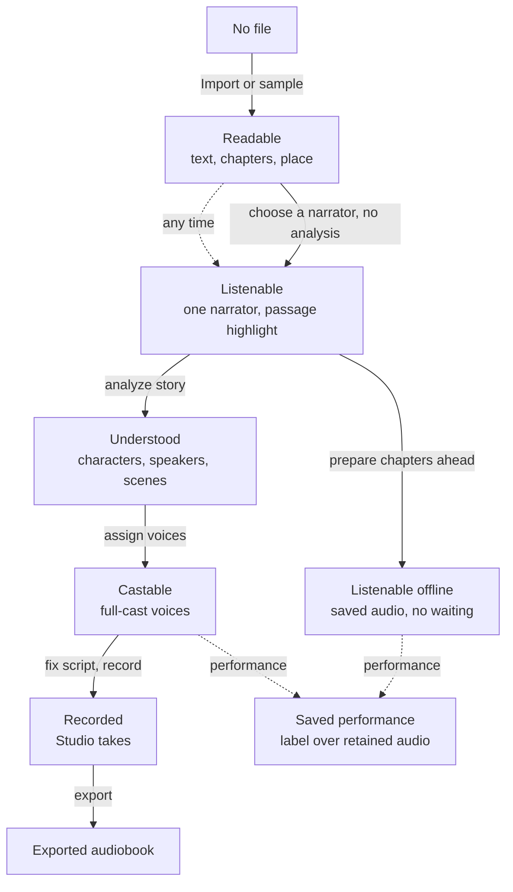
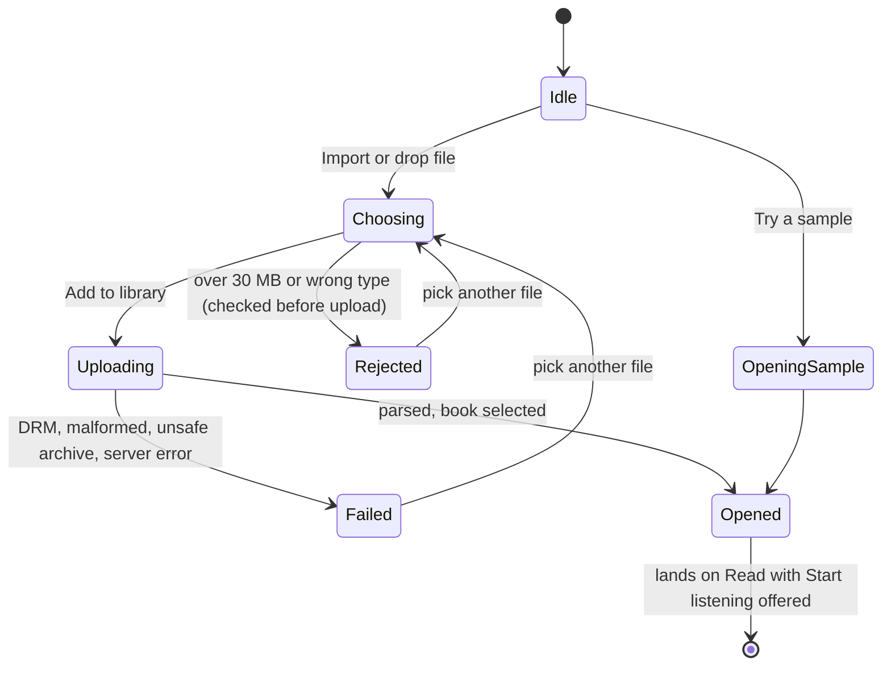
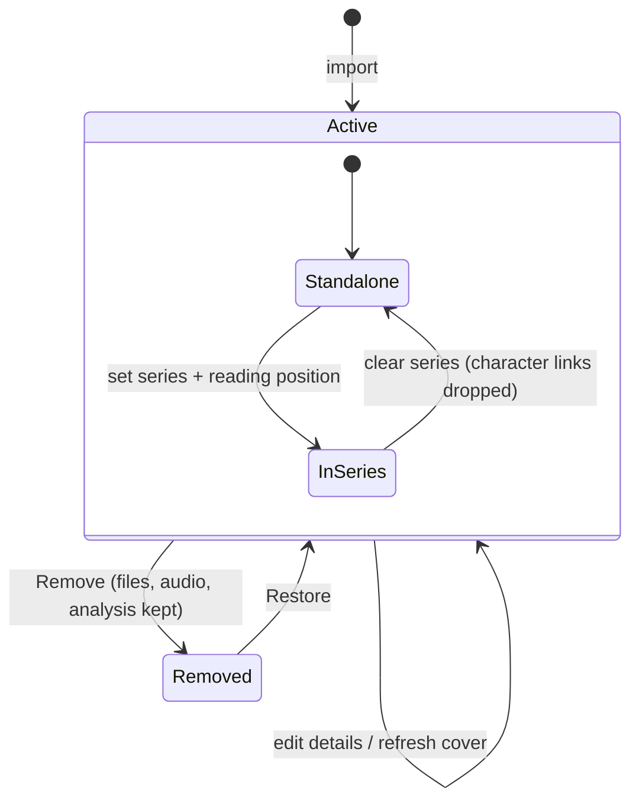
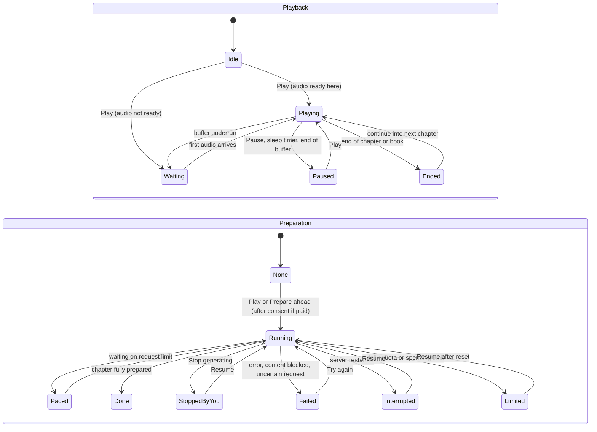
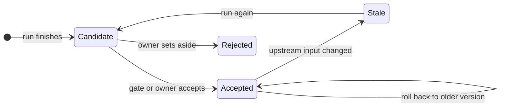

# UX redesign: foundations

Working draft, 2026-09-30. Nothing here is implemented. It is derived from the code at `b741bff` and the checked-in contract (0.5.0), so it describes what the product does today, then proposes what to design.

**Scope of this pass:** viewing the library, adding books, reading, and starting to listen. Analysis, casting, script editing, recording, performances and voice design are mapped only enough to reserve room for them.

**Sources read:** `README.md`, `docs/ARCHITECTURE.md`, `docs/UI-GUIDE.md`, `docs/LIBRARY-LISTENING-RESOURCES.md`, `docs/DATA-MODEL.md`, `bardic/static/{index.html, app.js, shell.js, lifecycle.js, listen-status.js, library.js}` and `contract/openapi.json`.

---

## 1. What the code says about today's UX

1. **One screen serves three jobs.** Shelf (find a book), Listener (read and hear it) and Studio (analyze, cast, script, record, inspect). The book's five tabs are ordered by the *production pipeline* (`Read & listen · Analyze · Cast · Script & record · Details`), so a listener lives in tab 1 and four tabs of production tooling sit beside it.
2. **The book has four status surfaces.** The lifecycle strip, the job banner, the player status pill, and the one-line narrator summary each report a different slice. `UI-GUIDE.md` already says "one status for the book"; in practice there are four.
3. **"What will play" is three different things.** *One narrator* (simple listening, sessions per narrator config), *Full cast* (Studio takes) and a *Performance* (a saved label over retained audio). They are chosen in the same sheet, live in different tables, and have different failure modes. A user has to learn the data model to know why Play did or did not work.
4. **The library is in four places.** Sidebar list, home shelf (`#home-books`), the **Books & series** modal (metadata, series, storage, Removed items) and, for series processing, a modal inside that modal. Import has three buttons that open one dialog.
5. **Playback status is two machines rendered as one pill.** *Playback* (playing, paused, buffering, ended) and *preparation* (no job, queued, running, waiting on rate limit, completed, cancelled, failed, interrupted, quota or budget limited) are independent. `listen-status.js` collapses them into ten labels. That is a good derived view, but the design has to keep both axes visible when they disagree (for example: playing, but preparation failed).
6. **Reader-relevant state is browser-local.** Reading position (`bardic:progress:<id>`), last book, speed, narrator sessions (`bardic:listen:<id>`), reader appearance, paid-listening consent (sessionStorage) never reach the server. That means there is no "Continue listening" on the shelf, and a phone and an iPad on the same library do not share a place. See section 8.
7. **The shelf has no listening information.** `renderLibrary()` draws cover, title, author and "Open book". No progress, no "last listened", no "audio ready", no series grouping. `LibraryBookSummary` already carries `audio_count`, `chapter_count`, `word_count`, `membership` and `analysis`, so some of this is available now.

Not problems: the trust and cost rules are strong and should be kept as fixed constraints (section 7).

---

## 2. Nouns

"User-facing" means the current UI shows it as a concept, not that it should stay that way.

| Noun | What it is | Key attributes | Today |
| --- | --- | --- | --- |
| **Library** | The whole local collection | books, series, storage, removed items | Sidebar, home shelf, manager modal |
| **Book** | One imported work | title, author, cover, language, source file, chapters | Everywhere |
| **Series** | Ordered set of books | name, numeric reading position (decimals allowed), volume slots | Manager modal, Cast > Series panel |
| **Volume slot** | A position in a series | `available` (a book) or `missing` / `planned` (a placeholder, no text) | Manager modal |
| **Chapter** | Source container | title, `kind` (narrative, front, back matter), order | Reader menu, contents list |
| **Scene / Passage** | Sub-chapter units; passage is the atomic unit of text, audio and highlight | exact source span, speaker, kind | Passage is the tap target; scene is Studio-only |
| **Place** (bookmark) | Reading position | chapter, passage, offset in audio | Browser-local only |
| **Narrator** | Who reads aloud | provider (Mac, Gemini, Breeze) + voice + speed | Sheet, narrator line, player |
| **Voice** | A named, versioned provider voice | library voice, current version, Default | Voices page (shared across books) |
| **Provider** | Service behind narration or analysis | key, availability, cost class (free, paid, self-hosted) | Settings modal |
| **Listening source** | What Play reads | One narrator, Full cast, or a Performance | Sheet mode toggle |
| **Take** | One audio clip for a passage or chunk | provider, model, voice, content hash | Hidden; drives "ready" underlines |
| **Job** | Background work | kind, status, progress, cancel | Job banner, pill |
| **Performance** | Saved plan to record chapters ahead | narrator or cast, chapters, status | Sheet tab and Studio hub |
| **Estimate / Consent** | Preview of scope and cost before paid or off-device work | requests, cost (unknown is not zero), what is sent | Inline panels |
| **Character / Cast** | Book-local speakers with voice choices | evidence, profile, voice per provider | Cast tab |
| **Analysis step / version** | A run's candidate output and its acceptance | candidate, accepted, rejected, stale | Analyze tab |
| **Script / Recording / Export** | Speaker-labeled passages, full-cast takes, packaged audiobook | | Script & record |
| **Pronunciation** | Respelling used only in narration | term, respelling | Cast tab |
| **Reader appearance** | Theme, size, font, spacing, width | | Reader `Aa` panel |
| **Settings** | Provider keys, models, limits, diagnostics | | Modal |

## 3. Verbs

Grouped by phase. **Cost class** matters for design because it decides whether a confirmation step exists: F = free/local, S = self-hosted (GPU, no charge), $ = may incur charges, ↗ = sends text off the device.

| Phase | Verb | Cost | Notes |
| --- | --- | --- | --- |
| Shelf | Browse, search (title/author), open, continue | F | Search is client-side filtering today |
| Shelf | Import file, try sample | F | 30 MB, `.epub` or UTF-8 `.txt`; DRM refused |
| Shelf | Edit details, refresh cover, add to series, remove, restore | F | Removal is soft; frees no disk |
| Read | Choose chapter, move place, next or previous chapter | F | Tapping moves the place only; never plays |
| Read | Change appearance, enter or leave reader view | F | |
| Listen | Choose narrator (draft), apply, hear example | F / S / $↗ | Draft sends nothing; example is one request |
| Listen | Play, pause, stop, seek, ±15 s, speed, sleep | F | Play is the only verb that can start generation |
| Listen | Prepare ahead, queue chapter, resume, stop generating | F / S / $↗ | Paid path asks consent once per book per tab |
| Listen | Keep going into next chapter | F / S / $↗ | Can queue the next chapter's job automatically |
| Perform | Create, add chapters to, record, listen while recording | $↗ | Estimate first |
| Make | Analyze (plan, confirm, run, review, accept, reject), cast, fix script, record, export | $↗ | Later phase |
| System | Connect provider, check access, refresh models, download log | F / $ | Check API is a tiny paid request |

---

## 4. State models

### 4.1 Book capability ladder

The most important structural fact: each rung is additive and **never locks a lower rung**. The current tab order hides this by presenting a pipeline.

### 4.2 Import

Server-side failures have stable error codes; the design needs a message and a next step per code, not a generic banner.

### 4.3 Library item

Volume slots in a series: `available` (a book), `missing`, `planned`. A placeholder is replaced by importing and assigning the real book at that position.

### 4.4 Listening: two machines and a derived pill

Playback and preparation move independently. The pill (`listen-status.js`) is a summary and should stay a summary.

Derived pill labels: *Choose a narrator, Preparing audio, Playing (time ready ahead), Waiting for the request limit, Paused, Daily or Spending limit reached, Preparation stopped, Could not prepare audio, Preparation interrupted, Finished.* Rules to keep: cancelled, failed and interrupted stay distinct; a limit is not a failure; Pause does not read as "stopped".

### 4.5 Choosing a narrator

```mermaid
stateDiagram-v2
    [*] --> Applied: saved choice or default
    Applied --> Browsing: open sheet
    Browsing --> Browsing: change provider, voice, source (draft; sends nothing)
    Browsing --> Auditioning: Hear example (one request; paid says so)
    Auditioning --> Browsing
    Browsing --> ConsentRequired: Use this narrator, paid provider, no consent this tab
    ConsentRequired --> Applied: confirm (one stop, restart same place)
    Browsing --> Applied: Use this narrator (free or self-hosted)
    Browsing --> Blocked: provider unavailable (no key, server offline)
    Blocked --> Browsing: Set up (opens Settings)
    Browsing --> Applied: cancel (draft discarded)
```

Sources the sheet can apply: One narrator, Full cast (Studio takes), a Performance. A narrator configuration remembers its own saved audio; switching back replays it with no new request.

### 4.6 Deferred but reserved: analysis version, job, performance

These share one status vocabulary with 4.4, so the component library should define it once.

Job statuses: queued, running, completed, failed, cancelled, interrupted, quota_limited, budget_limited. Performance statuses add: not recorded yet, partly recorded, complete, complete with fallback voice, blocked by Gemini.

---

## 5. Foundation flows to design

Each flow lists states the screen must show. Empty, loading, error and "unknown" are first-class, because the product's rules forbid guessing (unknown cost is not zero, unknown status is not "done").

**F1. First run and empty library**
Entry: no books. Offer *Import a book* and *Try a sample* equally; say what happens next (you can listen without analysis) and what stays local. States: empty, importing sample, sample failed. Exit: F3.

**F2. Library (returning user)**
Entry: app open, or Library from anywhere. Content: a way to resume (the last book with its place), the shelf (cover, title, author), series grouping, search, add. Per-book signals that exist today: chapters, words, `audio_count`, series membership, analysis summary. Signals that need new state: last listened, progress, "ready offline" (see section 8). States: loading, empty, no search results, book with missing cover, series with missing volumes, removed items (reachable but not competing).
Management (edit details, series order, remove/restore, storage) is a secondary surface, not the shelf itself.

**F3. Add a book**
Entry: any Import affordance. States as 4.2. Requirements: pre-upload size and type check; a message per server error code; on success, land on the book with *Start listening* offered (today a toast says this). Also: what if the book already exists (no dedupe in the contract; flag as an open question).

**F4. Book home and reading**
Entry: open from shelf, or resume. Content: title, chapter navigation, the text with a visible place, contents list, narrator summary. Interaction rules to keep: tap moves the place and never plays; keyboard model (text is one tab stop, arrows move passages); reader view is a display mode, not a destination. States: loading, book without chapters, front or back matter selected, chapter with no passages.

**F5. Start listening**
Entry: Play or *Start listening*. Two sub-flows:
1. *Returning listener with a narrator:* Play, warm-up (preparing with time to first audio), playing.
2. *First time or changing narrator:* the sheet, states as 4.5, including the paid consent and blocked provider cases.
Design questions: how much of the sheet a first-time listener needs (probably: three providers as cards with cost/availability, a voice, Hear example, Start) versus what moves out (Prepare ahead, Keep going, performances).

**F6. Player**
Always available once a book is open. Content: cover, chapter, narrator, position, speed, sleep, ±15 s, chapter-wide scrubber with a ready-audio shade, derived status with a single recovery action (Try again, Resume). States: every label in 4.4, plus the ended-chapter and ended-book cases, buffering while playing, and the "playing but preparation failed" combination.

**F7 (adjacent, needed for a coherent shell): Settings and providers**
Only what F5 needs for the "Set up →" exit: connect a provider, check connection. Full settings redesign is later.

---

## 6. Candidate structures

All three keep: Library, Voices, Settings as global places; the book as the unit of work; the player as global.

### A. Listener-first tabs (smallest change)
Book tabs become **Listen · Cast & script · Details**, with Analyze and Record folded into a "Make a performance" flow. Reading/listening is the default and Studio work is one step deeper.
- Pros: keeps most of today's routes and element IDs; cheap.
- Cons: still one dense workspace; the ladder in 4.1 stays implicit; the listening-source confusion (finding 3) remains.

### B. Two modes: Listen and Studio
A book has a mode switch. *Listen* is reader plus player only. *Studio* holds Analyze → Cast → Script → Record as a stepper that is the lifecycle strip promoted to navigation, with Details as an inspector.
- Pros: makes the ladder explicit; Studio is never in a listener's way; one status surface per mode.
- Cons: the *Performance* concept straddles both modes; a user who wants only "narrate chapters ahead" needs to find it in Listen.

### C. Audiobook-app model (recommended target)
- **Library** = Continue row plus shelf, grouped by series.
- **Book page** = cover, primary action (Listen or Continue), chapter list with per-chapter readiness, saved performances, a "Make a performance" entry.
- **Now Playing** = the read-along itself: text is the body, player is the frame, reader view is a full-bleed variant.
- **Studio** = stage flow launched from the book page, matching the lifecycle stages.
- Pros: matches how listeners already think (Books, Audible, Libby), maps to phone and iPad (the README calls out a 12.9-inch iPad and lock-screen controls), and gives dedicated clients (contract intent) a natural screen list. Performances become "versions of this book you can play" rather than a tab.
- Cons: biggest change; needs progress and readiness data the API lacks today (section 8); web UI can only adopt it incrementally.

### Comparison

| Criterion | A | B | C |
| --- | --- | --- | --- |
| Change to existing routes | small | medium | large (new book page) |
| Ladder (4.1) visible | no | yes | yes |
| Listening source confusion reduced | little | some | most (performance = playable version) |
| Fits phone and iPad | partly | partly | yes |
| Works with today's API | yes | yes | mostly, plus section 8 gaps |
| Studio work stays out of the listener's way | partly | yes | yes |

**Recommendation:** design for C, and make each screen map to a route the web app already has so it can land in slices (pragmatic path), rather than designing A and redoing it when a dedicated client arrives (long-term cost). Proposed route map:

| Route | Screen | Existing equivalent |
| --- | --- | --- |
| `#/library` | Library | `#/library` |
| `#/book/<id>` | Book page (new) | none |
| `#/book/<id>/read` | Now Playing / reader | `#/book/<id>/read` |
| `#/book/<id>/studio/<stage>` | Studio stages | `analysis`, `cast`, `studio`, `details` |
| `#/voices` | Voices | `#/voices` |
| `#/settings` | Settings (page instead of modal) | dialog |

---

## 7. Constraints the design must carry

From `AGENTS.md`, `UI-GUIDE.md` and the listening docs. These are not preferences.

- **No paid or off-device work without an estimate and a confirmation** whose label carries scope and cost. Unknown cost reads "Cost unknown", never $0. Gemini is labeled "paid" everywhere it appears.
- **Browsing, tapping, or opening never generates.** Only Play, Queue chapter, Resume, Record and equivalents do.
- **Cancelled, failed, interrupted, limited and unknown are distinct states** with distinct next steps.
- **Text is canonical.** The UI shows exact passages; nothing rewrites them.
- **Simple listening is independent of casting.** Cast edits never disturb one-narrator audio.
- **Removal is reversible** and frees no disk; say so.
- **One primary action per surface;** one status source per book; headings name the job.
- **Accessibility already tested:** contrast 4.5:1 text and 3:1 borders and focus, four reader themes, keyboard model, reduced motion, 44 px touch targets, safe areas.
- **Tokens exist** (`tokens.css`, plum accent, serif for story and sans for operations). Figma variables should be built from them, not invented.

## 8. Gaps to resolve before designing certain screens

1. **Reading position and last-listened** are browser-local. A "Continue" row and cross-device resume need a server-held place (a new API surface, so a contract change). Decide whether the redesign assumes it.
2. **Per-chapter readiness** (how much of a chapter has saved audio for the current narrator) is derivable from takes but there is no cheap read for a whole book. A book page with chapter readiness wants one.
3. **Narrator preference per book** lives in `localStorage` sessions. A second device starts over.
4. **Duplicate imports** are not detected in the contract.
5. **Search** is client-side over the shelf and separate from passage search (Details). Decide whether the redesign merges them.
6. **Series on the shelf:** the API has series and reading order; whether the shelf groups by series, or offers a switch, is a product decision.

## 9. Decisions needed from you

1. **Target platforms and priority:** desktop web only for now, or iPad and phone as first-class from the start? This changes layout breakpoints and the player pattern.
2. **Structure:** confirm C as the target (with A or B as the interim), or pick another.
3. **Brand:** keep the existing tokens (plum, serif and sans) as the visual base, or is the look also up for redesign?
4. **Server-side place and progress:** in scope (contract change) or design around browser-local state?

## 10. Figma plan (once structure is settled)

1. Variables from `tokens.css` (color light/dark plus the four reader themes, type, space, radius, elevation, control heights).
2. Base components: button (primary, subtle, text, danger; sizes), badge/status (one tone map), callout, chip/segmented/option card, consent block, cover, book card, list row, sheet/modal, section head, steps strip.
3. Player components covering every state in 4.4.
4. Flow frames F1–F6 at phone, tablet and desktop widths, with state variants.
5. A FigJam or diagram page for the state models in section 4.

**Tool status:** the Figma design tools (`use_figma`, `generate_figma_design`, `create_new_file`, `generate_diagram`) are not exposed in this session. Only shader, plugin and Weave tools are. Step 10 is blocked until they are, or until you give me an existing file to work in through another route.

---

## 11. Decisions log (2026-09-30)

| # | Decision | Choice |
| --- | --- | --- |
| 1 | Book structure | Audiobook-app model (candidate C) |
| 2 | Platform priority | Phone and iPad first-class; desktop adapts |
| 3 | Look | **B1 "Aurora glass"**: dark base and glows derived from the cover, frosted glass, one accent lifted for contrast |
| 4 | Reading position and progress | Server-held (contract change needed) |
| 5 | Library navigation | No sidebar book list; the shelf is the list |
| 6 | Shelf grouping | By series, missing volumes inline |
| 7 | Book management | A Manage page or sheet plus the book's "…" menu |
| 8 | Listening status | Playback leads; preparation as a second line when it needs attention |
| 9 | Performances | Listed on the book page under "Ways to listen" |
| 10 | Settings | Full page |
| 11 | Next step | Revise boards, then tablet layouts and the reader appearance panel |

Decision 3 supersedes the "keep the existing tokens" assumption in section 7 and the Figma plan in section 10. Accessibility floors (4.5:1 text, 3:1 controls and focus, 44 px targets) and the consent rules still apply to any new look.

Later decisions (2026-09-30):

- **Now Playing has two modes.** *Listen*: cover, title and transport with speed, sleep, chapters and narrator; no passage text. *Read*: the text fills the screen and the controls are one floating capsule that opens a drawer; the capsule and cover never grow on any device.
- **Orientation.** Phones are portrait-only. Tablets support portrait (mode switch) and landscape (Listen on the left with all controls, Read on the right with none).
- **Top bar stays** in Read mode.
- **Cover colour.** The palette is derived from a colour sample of the cover, so a sample must be stored with the cover (a small backend addition).
- The canvas keeps only the B1 look; the earlier A, B, C, B2 and B3 explorations were removed at the owner's request.
